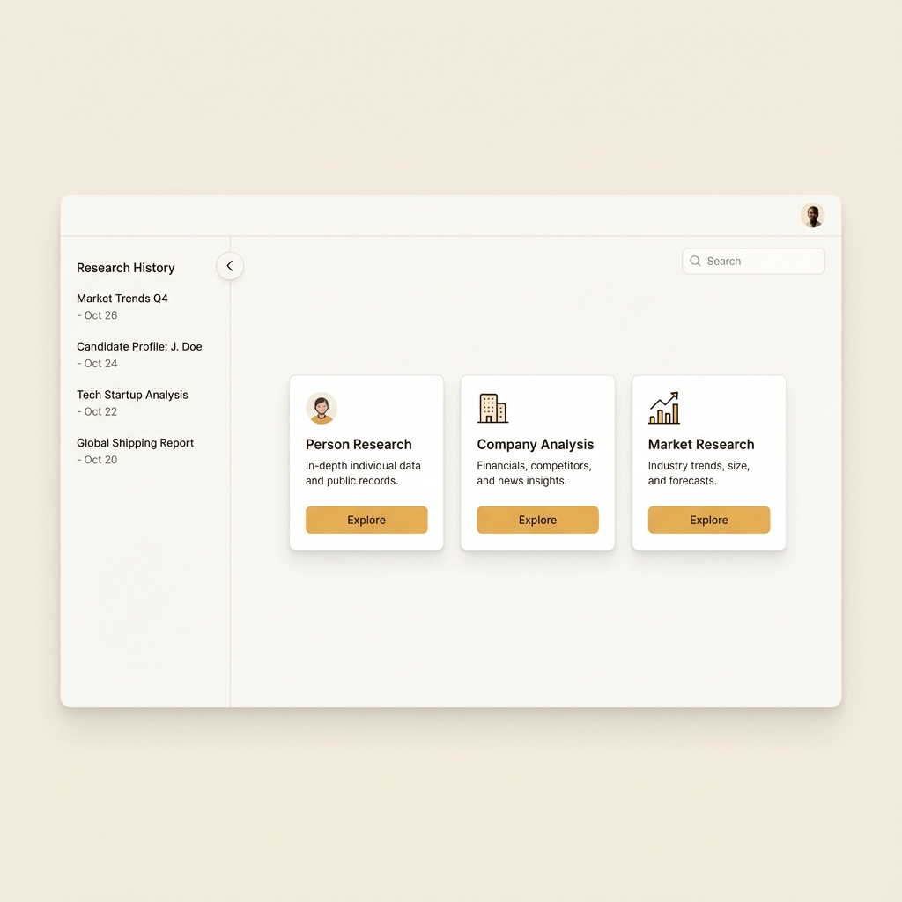

# Claude-Style UI Redesign - Detailed Implementation Plan

Complete redesign of the Intelligent Research Agent interface to match Claude app's clean, minimal aesthetic with a collapsible sidebar layout.

## UI Mockup



---

## Design System Overview

### Color Palette

| Token | Light Mode | Dark Mode | Usage |
|-------|-----------|-----------|-------|
| `--bg-main` | `#FAF9F7` | `#1A1A1A` | Page background |
| `--bg-sidebar` | `#F5F4F2` | `#262626` | Sidebar background |
| `--bg-card` | `#FFFFFF` | `#2D2D2D` | Card/panel background |
| `--bg-hover` | `#EFEEEC` | `#363636` | Hover states |
| `--bg-active` | `#E8E7E5` | `#404040` | Active/selected states |
| `--text-primary` | `#1A1A1A` | `#FAFAFA` | Headings, primary text |
| `--text-secondary` | `#5D5D5D` | `#A3A3A3` | Body text |
| `--text-muted` | `#8E8E8E` | `#737373` | Hints, timestamps |
| `--accent-primary` | `#D97706` | `#F59E0B` | Primary buttons, links |
| `--accent-hover` | `#B45309` | `#D97706` | Primary hover |
| `--border` | `#E5E5E3` | `#404040` | Borders, dividers |
| `--shadow` | `rgba(0,0,0,0.04)` | `rgba(0,0,0,0.3)` | Subtle shadows |

### Typography

```css
--font-family: 'Inter', -apple-system, BlinkMacSystemFont, sans-serif;
--font-size-xs: 0.75rem;    /* 12px - timestamps, badges */
--font-size-sm: 0.875rem;   /* 14px - secondary text */
--font-size-base: 1rem;     /* 16px - body text */
--font-size-lg: 1.125rem;   /* 18px - section headers */
--font-size-xl: 1.5rem;     /* 24px - page titles */
```

### Layout Dimensions

```css
--sidebar-width: 260px;
--sidebar-collapsed-width: 0px;
--header-height: 56px;
--content-max-width: 900px;
--card-border-radius: 12px;
--spacing-unit: 8px;
```

---

## Phase 1: Design System Foundation

**Objective:** Establish the new design tokens and base styles.

### Step 1.1: Update CSS Variables

#### [MODIFY] [variables.css](file:///f:/01%20Training/AntiGravity/intelligent-research-agent/intelligent-research-agent/frontend/styles/variables.css)

Replace entire file with new design system:

```css
:root {
    /* Color Palette - Light Mode (Default) */
    --bg-main: #FAF9F7;
    --bg-sidebar: #F5F4F2;
    --bg-card: #FFFFFF;
    --bg-hover: #EFEEEC;
    --bg-active: #E8E7E5;
    --bg-input: #FFFFFF;
    
    --text-primary: #1A1A1A;
    --text-secondary: #5D5D5D;
    --text-muted: #8E8E8E;
    --text-inverse: #FFFFFF;
    
    --accent-primary: #D97706;
    --accent-hover: #B45309;
    --accent-secondary: #0D9488;
    --accent-success: #059669;
    --accent-error: #DC2626;
    --accent-warning: #F59E0B;
    
    --border-color: #E5E5E3;
    --border-light: #F0F0EE;
    
    --shadow-sm: 0 1px 2px rgba(0, 0, 0, 0.04);
    --shadow-md: 0 4px 6px rgba(0, 0, 0, 0.04);
    --shadow-lg: 0 10px 15px rgba(0, 0, 0, 0.06);
    
    /* Typography */
    --font-family: 'Inter', -apple-system, BlinkMacSystemFont, sans-serif;
    --font-size-xs: 0.75rem;
    --font-size-sm: 0.875rem;
    --font-size-base: 1rem;
    --font-size-lg: 1.125rem;
    --font-size-xl: 1.5rem;
    --font-size-2xl: 1.875rem;
    --line-height-tight: 1.25;
    --line-height-normal: 1.5;
    --line-height-relaxed: 1.75;
    
    /* Layout */
    --sidebar-width: 260px;
    --header-height: 56px;
    --content-max-width: 900px;
    --radius-sm: 6px;
    --radius-md: 10px;
    --radius-lg: 14px;
    --radius-full: 9999px;
    
    /* Spacing Scale */
    --space-1: 4px;
    --space-2: 8px;
    --space-3: 12px;
    --space-4: 16px;
    --space-5: 20px;
    --space-6: 24px;
    --space-8: 32px;
    --space-10: 40px;
    --space-12: 48px;
    
    /* Transitions */
    --transition-fast: 150ms ease;
    --transition-base: 200ms ease;
    --transition-slow: 300ms ease;
}

/* Dark Mode */
[data-theme="dark"] {
    --bg-main: #1A1A1A;
    --bg-sidebar: #262626;
    --bg-card: #2D2D2D;
    --bg-hover: #363636;
    --bg-active: #404040;
    --bg-input: #2D2D2D;
    
    --text-primary: #FAFAFA;
    --text-secondary: #A3A3A3;
    --text-muted: #737373;
    --text-inverse: #1A1A1A;
    
    --accent-primary: #F59E0B;
    --accent-hover: #D97706;
    
    --border-color: #404040;
    --border-light: #333333;
    
    --shadow-sm: 0 1px 2px rgba(0, 0, 0, 0.2);
    --shadow-md: 0 4px 6px rgba(0, 0, 0, 0.25);
    --shadow-lg: 0 10px 15px rgba(0, 0, 0, 0.3);
}
```

### Step 1.2: Add Google Font

Update `index.html` `<head>`:
```html
<link rel="preconnect" href="https://fonts.googleapis.com">
<link rel="preconnect" href="https://fonts.gstatic.com" crossorigin>
<link href="https://fonts.googleapis.com/css2?family=Inter:wght@400;500;600;700&display=swap" rel="stylesheet">
```

**Success Criteria:**
- [x] New color variables defined
- [x] Typography system established
- [x] Spacing scale implemented
- [x] Dark mode support ready

---

## Phase 2: Layout Structure Redesign

**Objective:** Create the new app shell with collapsible sidebar.

### Step 2.1: New HTML Structure

#### [MODIFY] [index.html](file:///f:/01%20Training/AntiGravity/intelligent-research-agent/intelligent-research-agent/frontend/index.html)

New layout structure (replacing current body content):

```html
<body>
    <!-- App Container -->
    <div class="app-layout" id="appLayout">
        
        <!-- Collapsible Sidebar -->
        <aside class="sidebar" id="sidebar">
            <div class="sidebar-header">
                <div class="sidebar-brand">
                    <i class="fa-solid fa-robot"></i>
                    <span class="brand-text">ResearchAgent</span>
                </div>
                <button class="sidebar-close-btn" id="sidebarCloseBtn" title="Close sidebar">
                    <i class="fa-solid fa-xmark"></i>
                </button>
            </div>
            
            <div class="sidebar-actions">
                <button class="new-research-btn" id="newResearchBtn">
                    <i class="fa-solid fa-plus"></i>
                    <span>New Research</span>
                </button>
            </div>
            
            <div class="sidebar-section">
                <div class="section-label">Recent Research</div>
                <div class="sidebar-search">
                    <i class="fa-solid fa-search"></i>
                    <input type="text" id="historySearch" placeholder="Search...">
                </div>
            </div>
            
            <div class="sidebar-content" id="historyList">
                <!-- History items populated by JS -->
            </div>
            
            <div class="sidebar-footer">
                <div class="user-menu" id="userProfile">
                    <!-- User info populated by JS -->
                </div>
                <button class="theme-toggle-btn" id="themeToggle" title="Toggle theme">
                    <i class="fa-solid fa-moon"></i>
                </button>
            </div>
        </aside>
        
        <!-- Sidebar Overlay (Mobile) -->
        <div class="sidebar-overlay" id="sidebarOverlay"></div>
        
        <!-- Main Content Area -->
        <main class="main-content" id="mainContent">
            <!-- Top Bar -->
            <header class="top-bar">
                <button class="sidebar-toggle-btn" id="sidebarToggleBtn" title="Toggle sidebar">
                    <i class="fa-solid fa-bars"></i>
                </button>
                
                <div class="top-bar-center">
                    <h1 class="page-title" id="pageTitle">Research Dashboard</h1>
                </div>
                
                <div class="top-bar-actions">
                    <div class="provider-select">
                        <select id="modelProvider">
                            <option value="gemini">Gemini</option>
                            <option value="openai">GPT-4o</option>
                            <option value="grok">Grok</option>
                        </select>
                    </div>
                </div>
            </header>
            
            <!-- Content Area -->
            <div class="content-wrapper">
                <!-- Dashboard View -->
                <div id="moduleDashboard" class="dashboard-view">
                    <div class="dashboard-header">
                        <h2>What would you like to research?</h2>
                        <p>Select a research module to get started</p>
                    </div>
                    <div class="module-grid" id="moduleGrid">
                        <!-- Module cards injected by JS -->
                    </div>
                </div>
                
                <!-- Active Module View -->
                <div id="activeModuleView" class="module-view hidden">
                    <div class="module-header">
                        <button class="back-btn" id="backBtn">
                            <i class="fa-solid fa-arrow-left"></i>
                            <span>Back</span>
                        </button>
                        <h2 id="activeModuleTitle">Module</h2>
                    </div>
                    
                    <div class="module-content">
                        <div class="input-panel" id="inputSection">
                            <div class="panel-header">
                                <h3>Configuration</h3>
                                <button class="panel-toggle" id="toggleInputBtn">
                                    <i class="fa-solid fa-chevron-up"></i>
                                </button>
                            </div>
                            <div class="panel-body" id="moduleFormContainer">
                                <!-- Form fields injected by JS -->
                            </div>
                            <div class="panel-footer">
                                <button class="btn-primary" id="runResearchBtn">
                                    <span class="btn-text">Start Research</span>
                                    <span class="btn-loader hidden"></span>
                                </button>
                            </div>
                        </div>
                        
                        <div class="output-panel" id="outputPanelContainer">
                            <!-- Output tabs and content -->
                        </div>
                    </div>
                </div>
            </div>
        </main>
    </div>
    
    <!-- Toast Container -->
    <div id="toastContainer" class="toast-container"></div>
    
    <!-- Scripts -->
    <script src="https://cdn.jsdelivr.net/npm/marked/marked.min.js"></script>
    <script src="modules/module-registry.js?v=4"></script>
    <script src="components/research-card.js?v=4"></script>
    <script src="components/output-panel.js?v=4"></script>
    <script src="modules/person-research.js?v=4"></script>
    <script src="modules/company-research.js?v=4"></script>
    <script src="modules/market-research.js?v=4"></script>
    <script src="history.js?v=4"></script>
    <script src="app.js?v=4"></script>
</body>
```

**Success Criteria:**
- [x] New semantic HTML structure
- [x] Sidebar with all sections
- [x] Main content with header and views
- [x] Proper accessibility attributes

---

## Phase 3: Core CSS Styling

**Objective:** Implement the visual design with clean, minimal aesthetics.

### Step 3.1: Base & Layout Styles

#### [MODIFY] [style.css](file:///f:/01%20Training/AntiGravity/intelligent-research-agent/intelligent-research-agent/frontend/style.css)

Complete rewrite with Claude-style aesthetics:

```css
/* ==================== Reset & Base ==================== */
*, *::before, *::after {
    box-sizing: border-box;
    margin: 0;
    padding: 0;
}

html {
    font-size: 16px;
    -webkit-font-smoothing: antialiased;
    -moz-osx-font-smoothing: grayscale;
}

body {
    font-family: var(--font-family);
    font-size: var(--font-size-base);
    line-height: var(--line-height-normal);
    color: var(--text-primary);
    background: var(--bg-main);
    min-height: 100vh;
}

/* ==================== App Layout ==================== */
.app-layout {
    display: flex;
    min-height: 100vh;
}

/* ==================== Sidebar ==================== */
.sidebar {
    width: var(--sidebar-width);
    height: 100vh;
    position: fixed;
    left: 0;
    top: 0;
    background: var(--bg-sidebar);
    border-right: 1px solid var(--border-color);
    display: flex;
    flex-direction: column;
    z-index: 100;
    transition: transform var(--transition-slow);
}

.sidebar.collapsed {
    transform: translateX(-100%);
}

.sidebar-header {
    padding: var(--space-4);
    display: flex;
    align-items: center;
    justify-content: space-between;
    border-bottom: 1px solid var(--border-light);
}

.sidebar-brand {
    display: flex;
    align-items: center;
    gap: var(--space-2);
    font-weight: 600;
    font-size: var(--font-size-lg);
    color: var(--text-primary);
}

.sidebar-brand i {
    color: var(--accent-primary);
    font-size: 1.25rem;
}

.sidebar-close-btn {
    display: none;
    background: none;
    border: none;
    color: var(--text-muted);
    cursor: pointer;
    padding: var(--space-2);
    border-radius: var(--radius-sm);
    transition: all var(--transition-fast);
}

.sidebar-close-btn:hover {
    background: var(--bg-hover);
    color: var(--text-primary);
}

.sidebar-actions {
    padding: var(--space-4);
}

.new-research-btn {
    width: 100%;
    display: flex;
    align-items: center;
    justify-content: center;
    gap: var(--space-2);
    padding: var(--space-3) var(--space-4);
    background: var(--accent-primary);
    color: var(--text-inverse);
    border: none;
    border-radius: var(--radius-md);
    font-size: var(--font-size-sm);
    font-weight: 500;
    cursor: pointer;
    transition: all var(--transition-fast);
}

.new-research-btn:hover {
    background: var(--accent-hover);
    transform: translateY(-1px);
    box-shadow: var(--shadow-md);
}

.sidebar-section {
    padding: var(--space-3) var(--space-4);
}

.section-label {
    font-size: var(--font-size-xs);
    font-weight: 600;
    color: var(--text-muted);
    text-transform: uppercase;
    letter-spacing: 0.05em;
    margin-bottom: var(--space-3);
}

.sidebar-search {
    position: relative;
}

.sidebar-search i {
    position: absolute;
    left: var(--space-3);
    top: 50%;
    transform: translateY(-50%);
    color: var(--text-muted);
    font-size: var(--font-size-sm);
}

.sidebar-search input {
    width: 100%;
    padding: var(--space-2) var(--space-3) var(--space-2) var(--space-8);
    background: var(--bg-card);
    border: 1px solid var(--border-color);
    border-radius: var(--radius-sm);
    font-size: var(--font-size-sm);
    color: var(--text-primary);
    transition: all var(--transition-fast);
}

.sidebar-search input:focus {
    outline: none;
    border-color: var(--accent-primary);
    box-shadow: 0 0 0 3px rgba(217, 119, 6, 0.1);
}

.sidebar-content {
    flex: 1;
    overflow-y: auto;
    padding: var(--space-2) var(--space-3);
}

/* History Items */
.history-item {
    display: flex;
    flex-direction: column;
    gap: var(--space-1);
    padding: var(--space-3);
    margin-bottom: var(--space-1);
    border-radius: var(--radius-md);
    cursor: pointer;
    transition: all var(--transition-fast);
}

.history-item:hover {
    background: var(--bg-hover);
}

.history-item.active {
    background: var(--bg-active);
}

.history-item-title {
    font-size: var(--font-size-sm);
    font-weight: 500;
    color: var(--text-primary);
    white-space: nowrap;
    overflow: hidden;
    text-overflow: ellipsis;
}

.history-item-subtitle {
    font-size: var(--font-size-xs);
    color: var(--text-muted);
}

.sidebar-footer {
    padding: var(--space-3) var(--space-4);
    border-top: 1px solid var(--border-light);
    display: flex;
    align-items: center;
    justify-content: space-between;
}

.user-menu {
    display: flex;
    align-items: center;
    gap: var(--space-2);
    flex: 1;
    min-width: 0;
}

.user-avatar {
    width: 32px;
    height: 32px;
    border-radius: var(--radius-full);
    object-fit: cover;
}

.user-avatar-placeholder {
    width: 32px;
    height: 32px;
    border-radius: var(--radius-full);
    background: var(--accent-primary);
    color: var(--text-inverse);
    display: flex;
    align-items: center;
    justify-content: center;
    font-size: var(--font-size-sm);
    font-weight: 600;
}

.user-info {
    flex: 1;
    min-width: 0;
}

.user-name {
    font-size: var(--font-size-sm);
    font-weight: 500;
    color: var(--text-primary);
    white-space: nowrap;
    overflow: hidden;
    text-overflow: ellipsis;
}

.theme-toggle-btn {
    background: none;
    border: none;
    color: var(--text-muted);
    cursor: pointer;
    padding: var(--space-2);
    border-radius: var(--radius-sm);
    transition: all var(--transition-fast);
}

.theme-toggle-btn:hover {
    background: var(--bg-hover);
    color: var(--text-primary);
}

/* Sidebar Overlay (Mobile) */
.sidebar-overlay {
    display: none;
    position: fixed;
    inset: 0;
    background: rgba(0, 0, 0, 0.5);
    z-index: 99;
    opacity: 0;
    transition: opacity var(--transition-base);
}

.sidebar-overlay.visible {
    opacity: 1;
}

/* ==================== Main Content ==================== */
.main-content {
    flex: 1;
    margin-left: var(--sidebar-width);
    display: flex;
    flex-direction: column;
    min-height: 100vh;
    transition: margin-left var(--transition-slow);
}

.main-content.expanded {
    margin-left: 0;
}

/* Top Bar */
.top-bar {
    height: var(--header-height);
    padding: 0 var(--space-6);
    display: flex;
    align-items: center;
    gap: var(--space-4);
    background: var(--bg-main);
    border-bottom: 1px solid var(--border-color);
    position: sticky;
    top: 0;
    z-index: 50;
}

.sidebar-toggle-btn {
    background: none;
    border: none;
    color: var(--text-secondary);
    cursor: pointer;
    padding: var(--space-2);
    border-radius: var(--radius-sm);
    transition: all var(--transition-fast);
}

.sidebar-toggle-btn:hover {
    background: var(--bg-hover);
    color: var(--text-primary);
}

.top-bar-center {
    flex: 1;
}

.page-title {
    font-size: var(--font-size-lg);
    font-weight: 600;
    color: var(--text-primary);
}

.top-bar-actions {
    display: flex;
    align-items: center;
    gap: var(--space-3);
}

.provider-select select {
    padding: var(--space-2) var(--space-3);
    background: var(--bg-card);
    border: 1px solid var(--border-color);
    border-radius: var(--radius-sm);
    font-size: var(--font-size-sm);
    color: var(--text-primary);
    cursor: pointer;
}

/* Content Wrapper */
.content-wrapper {
    flex: 1;
    padding: var(--space-8);
    overflow-y: auto;
}

/* ==================== Dashboard View ==================== */
.dashboard-view {
    max-width: var(--content-max-width);
    margin: 0 auto;
}

.dashboard-header {
    text-align: center;
    margin-bottom: var(--space-10);
}

.dashboard-header h2 {
    font-size: var(--font-size-2xl);
    font-weight: 600;
    color: var(--text-primary);
    margin-bottom: var(--space-2);
}

.dashboard-header p {
    font-size: var(--font-size-base);
    color: var(--text-secondary);
}

.module-grid {
    display: grid;
    grid-template-columns: repeat(auto-fill, minmax(280px, 1fr));
    gap: var(--space-6);
}

/* ==================== Module Cards ==================== */
.research-card {
    background: var(--bg-card);
    border: 1px solid var(--border-color);
    border-radius: var(--radius-lg);
    padding: var(--space-6);
    cursor: pointer;
    transition: all var(--transition-base);
}

.research-card:hover {
    border-color: var(--accent-primary);
    box-shadow: var(--shadow-lg);
    transform: translateY(-2px);
}

.card-icon-wrapper {
    width: 48px;
    height: 48px;
    border-radius: var(--radius-md);
    background: var(--bg-hover);
    display: flex;
    align-items: center;
    justify-content: center;
    font-size: 1.25rem;
    margin-bottom: var(--space-4);
}

.research-card[data-accent="blue"] .card-icon-wrapper {
    background: rgba(59, 130, 246, 0.1);
    color: #3B82F6;
}

.research-card[data-accent="purple"] .card-icon-wrapper {
    background: rgba(139, 92, 246, 0.1);
    color: #8B5CF6;
}

.research-card[data-accent="teal"] .card-icon-wrapper {
    background: rgba(20, 184, 166, 0.1);
    color: #14B8A6;
}

.card-content h3 {
    font-size: var(--font-size-lg);
    font-weight: 600;
    color: var(--text-primary);
    margin-bottom: var(--space-2);
}

.card-content p {
    font-size: var(--font-size-sm);
    color: var(--text-secondary);
    line-height: var(--line-height-relaxed);
}

/* ==================== Module View ==================== */
.module-view {
    max-width: var(--content-max-width);
    margin: 0 auto;
}

.module-header {
    display: flex;
    align-items: center;
    gap: var(--space-4);
    margin-bottom: var(--space-6);
}

.back-btn {
    display: flex;
    align-items: center;
    gap: var(--space-2);
    background: none;
    border: none;
    color: var(--text-secondary);
    font-size: var(--font-size-sm);
    cursor: pointer;
    padding: var(--space-2) var(--space-3);
    border-radius: var(--radius-sm);
    transition: all var(--transition-fast);
}

.back-btn:hover {
    background: var(--bg-hover);
    color: var(--text-primary);
}

.module-header h2 {
    font-size: var(--font-size-xl);
    font-weight: 600;
    color: var(--text-primary);
}

.module-content {
    display: flex;
    flex-direction: column;
    gap: var(--space-6);
}

/* Input Panel */
.input-panel {
    background: var(--bg-card);
    border: 1px solid var(--border-color);
    border-radius: var(--radius-lg);
    overflow: hidden;
}

.panel-header {
    padding: var(--space-4) var(--space-5);
    display: flex;
    align-items: center;
    justify-content: space-between;
    border-bottom: 1px solid var(--border-light);
}

.panel-header h3 {
    font-size: var(--font-size-base);
    font-weight: 600;
    color: var(--text-primary);
}

.panel-toggle {
    background: none;
    border: none;
    color: var(--text-muted);
    cursor: pointer;
    padding: var(--space-1);
    transition: all var(--transition-fast);
}

.panel-toggle:hover {
    color: var(--text-primary);
}

.panel-body {
    padding: var(--space-5);
}

.panel-footer {
    padding: var(--space-4) var(--space-5);
    border-top: 1px solid var(--border-light);
    background: var(--bg-sidebar);
}

/* Form Elements */
.form-group {
    margin-bottom: var(--space-5);
}

.form-group:last-child {
    margin-bottom: 0;
}

.form-group label {
    display: block;
    font-size: var(--font-size-sm);
    font-weight: 500;
    color: var(--text-secondary);
    margin-bottom: var(--space-2);
}

.form-group input,
.form-group select,
.form-group textarea {
    width: 100%;
    padding: var(--space-3);
    background: var(--bg-input);
    border: 1px solid var(--border-color);
    border-radius: var(--radius-sm);
    font-size: var(--font-size-base);
    color: var(--text-primary);
    transition: all var(--transition-fast);
}

.form-group input:focus,
.form-group select:focus,
.form-group textarea:focus {
    outline: none;
    border-color: var(--accent-primary);
    box-shadow: 0 0 0 3px rgba(217, 119, 6, 0.1);
}

.form-group textarea {
    min-height: 120px;
    resize: vertical;
}

/* Buttons */
.btn-primary {
    display: flex;
    align-items: center;
    justify-content: center;
    gap: var(--space-2);
    width: 100%;
    padding: var(--space-3) var(--space-4);
    background: var(--accent-primary);
    color: var(--text-inverse);
    border: none;
    border-radius: var(--radius-md);
    font-size: var(--font-size-base);
    font-weight: 500;
    cursor: pointer;
    transition: all var(--transition-fast);
}

.btn-primary:hover:not(:disabled) {
    background: var(--accent-hover);
}

.btn-primary:disabled {
    opacity: 0.6;
    cursor: not-allowed;
}

.btn-loader {
    width: 18px;
    height: 18px;
    border: 2px solid rgba(255, 255, 255, 0.3);
    border-top-color: white;
    border-radius: 50%;
    animation: spin 0.8s linear infinite;
}

@keyframes spin {
    to { transform: rotate(360deg); }
}

/* Output Panel */
.output-panel {
    background: var(--bg-card);
    border: 1px solid var(--border-color);
    border-radius: var(--radius-lg);
    min-height: 400px;
}

/* ==================== Responsive ==================== */
@media (max-width: 1024px) {
    .sidebar {
        transform: translateX(-100%);
    }
    
    .sidebar.open {
        transform: translateX(0);
    }
    
    .sidebar-close-btn {
        display: block;
    }
    
    .sidebar-overlay {
        display: block;
    }
    
    .main-content {
        margin-left: 0;
    }
}

@media (max-width: 640px) {
    .content-wrapper {
        padding: var(--space-4);
    }
    
    .module-grid {
        grid-template-columns: 1fr;
    }
    
    .top-bar {
        padding: 0 var(--space-4);
    }
}

/* ==================== Utilities ==================== */
.hidden {
    display: none !important;
}
```

**Success Criteria:**
- [x] Clean, minimal aesthetic
- [x] Responsive sidebar behavior
- [x] Proper spacing and typography
- [x] Smooth transitions

---

## Phase 4: Component Updates

**Objective:** Update JS components to work with new structure.

### Step 4.1: Update Research Card Component

#### [MODIFY] [research-card.js](file:///f:/01%20Training/AntiGravity/intelligent-research-agent/intelligent-research-agent/frontend/components/research-card.js)

Update card HTML structure:
```javascript
function createResearchCard(module) {
    const accentMap = {
        'person-research': 'blue',
        'company-research': 'purple',
        'market-research': 'teal'
    };
    
    return `
        <div class="research-card" 
             data-module-id="${module.id}" 
             data-accent="${accentMap[module.id] || 'blue'}"
             onclick="window.app.selectModule('${module.id}')">
            <div class="card-icon-wrapper">
                <i class="${module.icon}"></i>
            </div>
            <div class="card-content">
                <h3>${module.name}</h3>
                <p>${module.description}</p>
            </div>
        </div>
    `;
}
```

### Step 4.2: Update App.js for Sidebar

#### [MODIFY] [app.js](file:///f:/01%20Training/AntiGravity/intelligent-research-agent/intelligent-research-agent/frontend/app.js)

Add sidebar functionality:
```javascript
// Sidebar management
function initSidebar() {
    const sidebar = document.getElementById('sidebar');
    const mainContent = document.getElementById('mainContent');
    const toggleBtn = document.getElementById('sidebarToggleBtn');
    const closeBtn = document.getElementById('sidebarCloseBtn');
    const overlay = document.getElementById('sidebarOverlay');
    const newResearchBtn = document.getElementById('newResearchBtn');
    
    // Load saved state
    const savedState = localStorage.getItem('sidebarCollapsed');
    if (savedState === 'true') {
        sidebar.classList.add('collapsed');
        mainContent.classList.add('expanded');
    }
    
    // Toggle sidebar
    toggleBtn?.addEventListener('click', () => toggleSidebar());
    closeBtn?.addEventListener('click', () => closeSidebar());
    overlay?.addEventListener('click', () => closeSidebar());
    newResearchBtn?.addEventListener('click', () => {
        window.app.navigateToDashboard();
        closeSidebar();
    });
}

function toggleSidebar() {
    const sidebar = document.getElementById('sidebar');
    const mainContent = document.getElementById('mainContent');
    const overlay = document.getElementById('sidebarOverlay');
    
    const isMobile = window.innerWidth <= 1024;
    
    if (isMobile) {
        sidebar.classList.toggle('open');
        overlay.classList.toggle('visible');
    } else {
        sidebar.classList.toggle('collapsed');
        mainContent.classList.toggle('expanded');
        localStorage.setItem('sidebarCollapsed', sidebar.classList.contains('collapsed'));
    }
}

function closeSidebar() {
    const sidebar = document.getElementById('sidebar');
    const overlay = document.getElementById('sidebarOverlay');
    sidebar.classList.remove('open');
    overlay.classList.remove('visible');
}

// Theme toggle
function initTheme() {
    const themeBtn = document.getElementById('themeToggle');
    const savedTheme = localStorage.getItem('theme') || 'light';
    document.documentElement.setAttribute('data-theme', savedTheme);
    updateThemeIcon(savedTheme);
    
    themeBtn?.addEventListener('click', () => {
        const current = document.documentElement.getAttribute('data-theme');
        const next = current === 'light' ? 'dark' : 'light';
        document.documentElement.setAttribute('data-theme', next);
        localStorage.setItem('theme', next);
        updateThemeIcon(next);
    });
}

function updateThemeIcon(theme) {
    const icon = document.querySelector('#themeToggle i');
    if (icon) {
        icon.className = theme === 'light' ? 'fa-solid fa-moon' : 'fa-solid fa-sun';
    }
}
```

---

## Phase 5: Polish & Verification

**Objective:** Final touches and testing.

### Step 5.1: Add Smooth Animations

Add to `style.css`:
```css
/* Page transitions */
.dashboard-view, .module-view {
    animation: fadeIn 0.2s ease;
}

@keyframes fadeIn {
    from { opacity: 0; transform: translateY(8px); }
    to { opacity: 1; transform: translateY(0); }
}

/* Card entrance animation */
.research-card {
    animation: cardIn 0.3s ease backwards;
}

.research-card:nth-child(1) { animation-delay: 0ms; }
.research-card:nth-child(2) { animation-delay: 50ms; }
.research-card:nth-child(3) { animation-delay: 100ms; }
.research-card:nth-child(4) { animation-delay: 150ms; }

@keyframes cardIn {
    from { opacity: 0; transform: translateY(20px); }
    to { opacity: 1; transform: translateY(0); }
}
```

### Step 5.2: Sync to Backend

```powershell
Copy-Item -Path "frontend/*" -Destination "backend/static/" -Recurse -Force
```

### Step 5.3: Test Checklist

| Test | Status |
|------|--------|
| Sidebar collapses/expands on desktop | [ ] |
| Sidebar opens/closes on mobile | [ ] |
| Theme toggle works | [ ] |
| Module cards are clickable | [ ] |
| Research form submits | [ ] |
| History items load | [ ] |
| Responsive at all breakpoints | [ ] |

---

## Summary

| Phase | Files Modified | Estimated Time |
|-------|---------------|----------------|
| Phase 1 | `variables.css` | 10 min |
| Phase 2 | `index.html` | 20 min |
| Phase 3 | `style.css` | 40 min |
| Phase 4 | `research-card.js`, `app.js` | 20 min |
| Phase 5 | Final polish, testing | 15 min |
| **Total** | **5 files** | **~2 hours** |
